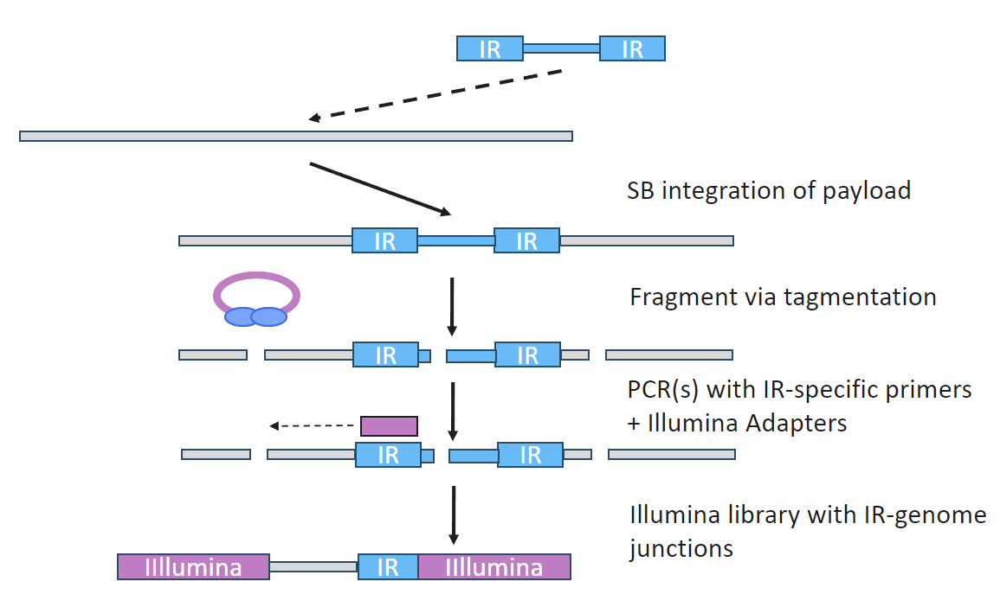
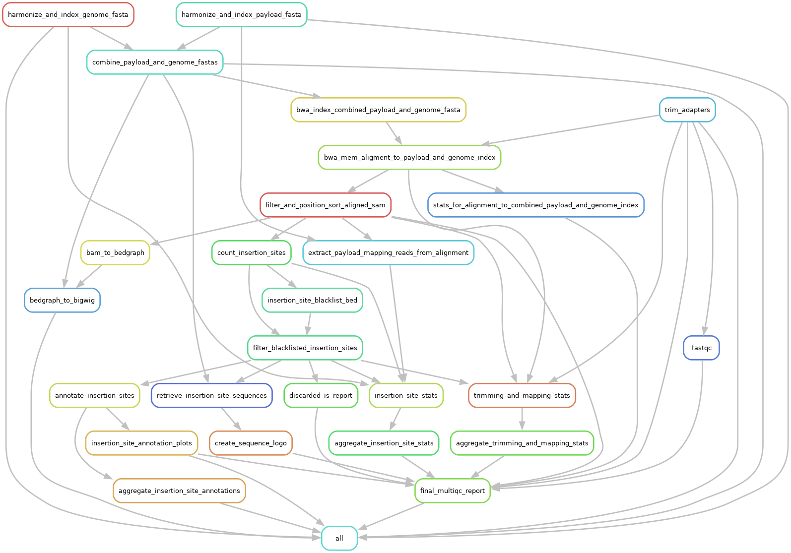

# TRACE ISA Analysis

TRACE Insertion Site Analysis (ISA) is transposon-based short-read sequencing
method to find the integration sites of randomly inserted payloads
in a heterogenous population.

This workflow processes raw TRACE ISA reads and outputs integration sites and
various plots and tables.



## Quickstart

For ease of deployment and reproducibility the workflow is written in Snakemake
and all software is supplied either in conda environments or docker containers.

To get started ensure Snakemake and either Singularity (for Docker deployment)
or Conda are first installed, and then clone the workflow repository locally.

```
git clone https://github.com/ensoma/ensoma-trace-isa-wf.git
```

Next, set the appropriate file/directory paths and parameters in the `config.yaml` file.

Finally, the workflow can be through docker via singularity (preferred).

```
snakemake --use-singularity --cores 6
```

Or using conda.

```
snakemake --use-conda --cores 6
```

## Inputs

This workflow requires paired-end Illumina sequencing data from TRACE insertion-site analysis.
These files must have the standard illumina naming scheme `*_S[0-9]+_L00[0-9]_R[12]_001.fastq.gz`.

There are genome and payload files that must be supplied:

 - Organism genome assembly (FASTA) and annotation file (GTF/GFF).
 - Payload sequence (FASTA) and annotation file (GBK).

The R1 and R2 5'-most adapters are specified as a cutadapt-formatted string in the options file.

The regions sheet is a 3 column haederless CSV with columns:

 - payload name (matching the payload fasta name).
 - start location of the regiont to capture.
 - end location of region to capture.

The sample sheet is a 5 column headerless CSV with columns:

 - sample name.
 - payload fasta file name.
 - payload genbank file name.
 - organism genome assembly.
 - organism genome annotation.

## Outputs

There are various outputs provided by this workflow for convenience.
The important outputs are as follows:

- Detailed MultiQC report of results (multiqc/multiqc_report.html)
- Bigwig genome tracks of the IS signal (tracks/*.bw)
- A table of insertion sites and their associated genomic annotation
(annotated_insertion_sites/aggregated_insertion_site_annotations.tsv)

## Workflow Overview

**Adapter Trimming**:
 - Utilize `cutadapt` to enforce required adapter and IR sequence/structure.
 - Trim adapters, IR, adapter-readthrough, and IR-readthrough.

**BWA Indexing and Alignment**:
 - Index the combined genome using `bwa`.
 - Align the trimmed reads to the genome + payload with `bwa mem`.

**Alignment Filtering, Sorting, and Deduplication**:
 - Filter aligned reads based on various flag values using `samtools`
 to ensure high confidence and unique insertion sites.
 - Remove PCR duplicates.
 - Discard insertion sites with with genome mismatches that are too aberrant.

**Genomic Tracks**:
 - Convert the payload BAM file to a BedGraph file using `bedtools`.
 - Convert the BedGraph file to a BigWig file using UCSC `bedGraphToBigWig`.

**Insertion Site Processing**:
 - Call insertion sites from the filtered BAM files.
 - Discard background insertion sites.
 - Annotate insertion sites to their associated genomic feature.

**Insertion Site Plots**:
 - Sequence logo of sequence surrounding insertion sites.
 - Histogram of insertion site distance to promoters and
 stacked bar plot of genomic feature distribution.
 - Stacked bar plot of insertion site signal fraction for both all
 insertion sites and only the top 10.

**MultiQC Report**:
 - Detailed report summarizing insertion site numbers, locations, and afformentioned plots.
 - Breakdown of FASTQ and SAM/BAM filtering steps.

A rulegraph is provided below for a more fine-grained view of the workflow.


